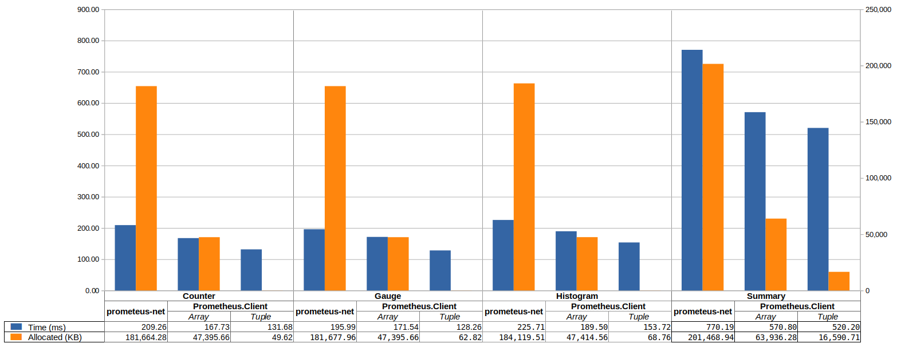

# General Use Case Benchmarks

## Legend
* **NoLabels** - 10 000 calls to resolve a metric (1000 unique metrics) without labels and then performing observation method.
* **WithLabels** - 10 000 calls to resolve a metric (1000 unique metrics) with labels and then performing observation method for unlabelled sample.
* **WithLabelsAndSamples** - 10 000 calls to resolve a metric (1000 unique metrics) with labels. For each metric resolving 100 samples (10 unique labels combinations) and then performing observation method on the sample.

## Benchmark Results

  
Counter

|                          Method |       Mean |     Error |    StdDev |     Median | Ratio | RatioSD |      Gen 0 | Gen 1 | Gen 2 |    Allocated |
|-------------------------------- |-----------:|----------:|----------:|-----------:|------:|--------:|-----------:|------:|------:|-------------:|
|               NoLabels_Baseline |   5.527 ms | 0.8440 ms | 0.9719 ms |   5.896 ms |  1.00 |    0.00 |          - |     - |     - |   1110.38 KB |
|                        NoLabels |   2.574 ms | 0.0415 ms | 0.0478 ms |   2.550 ms |  0.48 |    0.11 |          - |     - |     - |      6.96 KB |
|                  NoLabels_Int64 |   2.377 ms | 0.0279 ms | 0.0322 ms |   2.368 ms |  0.45 |    0.10 |          - |     - |     - |      6.88 KB |
|                                 |            |           |           |            |       |         |            |       |       |              |
|             WithLabels_Baseline |   8.221 ms | 2.0186 ms | 2.3246 ms |   6.648 ms |  1.00 |    0.00 |          - |     - |     - |   1893.11 KB |
|                WithLabels_Array |   3.417 ms | 0.2477 ms | 0.2852 ms |   3.272 ms |  0.45 |    0.12 |          - |     - |     - |    510.33 KB |
|                WithLabels_Tuple |   4.562 ms | 0.3896 ms | 0.4486 ms |   4.381 ms |  0.60 |    0.19 |          - |     - |     - |     15.95 KB |
|           WithLabels_Int64Array |   3.378 ms | 0.1422 ms | 0.1637 ms |   3.327 ms |  0.44 |    0.12 |          - |     - |     - |    509.91 KB |
|           WithLabels_Int64Tuple |   4.480 ms | 0.1170 ms | 0.1347 ms |   4.439 ms |  0.59 |    0.16 |          - |     - |     - |     15.87 KB |
|                                 |            |           |           |            |       |         |            |       |       |              |
|   WithLabelsAndSamples_Baseline | 209.255 ms | 6.8375 ms | 7.8741 ms | 207.752 ms |  1.00 |    0.00 | 44000.0000 |     - |     - | 181664.28 KB |
|      WithLabelsAndSamples_Array | 167.727 ms | 2.3358 ms | 2.6899 ms | 169.015 ms |  0.80 |    0.03 | 11000.0000 |     - |     - |  47395.66 KB |
|      WithLabelsAndSamples_Tuple | 131.681 ms | 1.8447 ms | 2.1243 ms | 132.430 ms |  0.63 |    0.03 |          - |     - |     - |     49.62 KB |
| WithLabelsAndSamples_Int64Array | 166.056 ms | 2.4496 ms | 2.8210 ms | 167.168 ms |  0.79 |    0.03 | 11000.0000 |     - |     - |     47395 KB |
| WithLabelsAndSamples_Int64Tuple | 128.643 ms | 1.3117 ms | 1.5105 ms | 129.282 ms |  0.62 |    0.02 |          - |     - |     - |     48.84 KB |

  
Gauge

|                          Method |       Mean |     Error |    StdDev | Ratio | RatioSD |      Gen 0 | Gen 1 | Gen 2 |    Allocated |
|-------------------------------- |-----------:|----------:|----------:|------:|--------:|-----------:|------:|------:|-------------:|
|               NoLabels_Baseline |   5.902 ms | 1.0438 ms | 1.2021 ms |  1.00 |    0.00 |          - |     - |     - |   1111.71 KB |
|                        NoLabels |   3.116 ms | 1.2250 ms | 1.4107 ms |  0.55 |    0.24 |          - |     - |     - |      6.96 KB |
|                  NoLabels_Int64 |   2.528 ms | 0.0889 ms | 0.1024 ms |  0.45 |    0.12 |          - |     - |     - |      6.88 KB |
|                                 |            |           |           |       |         |            |       |       |              |
|             WithLabels_Baseline |   8.395 ms | 1.9055 ms | 2.1944 ms |  1.00 |    0.00 |          - |     - |     - |   1891.48 KB |
|                WithLabels_Array |   3.375 ms | 0.1590 ms | 0.1832 ms |  0.43 |    0.12 |          - |     - |     - |    509.63 KB |
|                WithLabels_Tuple |   4.666 ms | 0.3102 ms | 0.3572 ms |  0.59 |    0.17 |          - |     - |     - |     15.95 KB |
|           WithLabels_Int64Array |   3.303 ms | 0.1799 ms | 0.2072 ms |  0.42 |    0.11 |          - |     - |     - |       510 KB |
|           WithLabels_Int64Tuple |   4.472 ms | 0.2815 ms | 0.3242 ms |  0.57 |    0.16 |          - |     - |     - |     15.87 KB |
|                                 |            |           |           |       |         |            |       |       |              |
|   WithLabelsAndSamples_Baseline | 195.994 ms | 2.3875 ms | 2.7494 ms |  1.00 |    0.00 | 44000.0000 |     - |     - | 181677.96 KB |
|      WithLabelsAndSamples_Array | 171.542 ms | 2.4775 ms | 2.8531 ms |  0.88 |    0.02 | 11000.0000 |     - |     - |  47395.66 KB |
|      WithLabelsAndSamples_Tuple | 128.261 ms | 1.2731 ms | 1.4661 ms |  0.65 |    0.01 |          - |     - |     - |     62.82 KB |
| WithLabelsAndSamples_Int64Array | 163.231 ms | 2.0083 ms | 2.3127 ms |  0.83 |    0.01 | 11000.0000 |     - |     - |  47408.98 KB |
| WithLabelsAndSamples_Int64Tuple | 130.312 ms | 1.4413 ms | 1.6598 ms |  0.66 |    0.01 |          - |     - |     - |     48.84 KB |

  
Histogram

|                        Method |       Mean |     Error |    StdDev | Ratio | RatioSD |      Gen 0 |     Gen 1 | Gen 2 |    Allocated |
|------------------------------ |-----------:|----------:|----------:|------:|--------:|-----------:|----------:|------:|-------------:|
|             NoLabels_Baseline |   6.875 ms | 0.1550 ms | 0.1785 ms |  1.00 |    0.00 |          - |         - |     - |   1251.83 KB |
|                      NoLabels |   2.600 ms | 0.0738 ms | 0.0850 ms |  0.38 |    0.02 |          - |         - |     - |      9.62 KB |
|                               |            |           |           |       |         |            |           |       |              |
|           WithLabels_Baseline |  10.536 ms | 1.8228 ms | 2.0992 ms |  1.00 |    0.00 |          - |         - |     - |   2111.52 KB |
|              WithLabels_Array |   3.573 ms | 0.1345 ms | 0.1549 ms |  0.36 |    0.10 |          - |         - |     - |    512.92 KB |
|              WithLabels_Tuple |   4.700 ms | 0.0904 ms | 0.1041 ms |  0.47 |    0.11 |          - |         - |     - |     18.91 KB |
|                               |            |           |           |       |         |            |           |       |              |
| WithLabelsAndSamples_Baseline | 225.711 ms | 3.3234 ms | 3.8272 ms |  1.00 |    0.00 | 44000.0000 | 1000.0000 |     - | 184119.51 KB |
|    WithLabelsAndSamples_Array | 189.502 ms | 2.6804 ms | 3.0868 ms |  0.84 |    0.02 | 11000.0000 |         - |     - |  47414.56 KB |
|    WithLabelsAndSamples_Tuple | 153.720 ms | 1.9484 ms | 2.2438 ms |  0.68 |    0.01 |          - |         - |     - |     68.76 KB |

  
Summary

|                        Method |       Mean |     Error |    StdDev | Ratio | RatioSD |      Gen 0 |     Gen 1 |     Gen 2 |    Allocated |
|------------------------------ |-----------:|----------:|----------:|------:|--------:|-----------:|----------:|----------:|-------------:|
|             NoLabels_Baseline |   9.607 ms | 0.5922 ms | 0.6820 ms |  1.00 |    0.00 |          - |         - |         - |   3003.81 KB |
|                      NoLabels |   4.239 ms | 0.1748 ms | 0.2012 ms |  0.44 |    0.03 |          - |         - |         - |    861.41 KB |
|                               |            |           |           |       |         |            |           |           |              |
|           WithLabels_Baseline |  10.812 ms | 1.8524 ms | 2.1333 ms |  1.00 |    0.00 |          - |         - |         - |   4021.23 KB |
|              WithLabels_Array |   5.283 ms | 0.4355 ms | 0.5015 ms |  0.51 |    0.13 |          - |         - |         - |   1364.72 KB |
|              WithLabels_Tuple |   6.605 ms | 0.5966 ms | 0.6871 ms |  0.63 |    0.11 |          - |         - |         - |    870.71 KB |
|                               |            |           |           |       |         |            |           |           |              |
| WithLabelsAndSamples_Baseline | 770.187 ms | 4.5413 ms | 5.2298 ms |  1.00 |    0.00 | 46000.0000 | 1000.0000 |         - | 201468.94 KB |
|    WithLabelsAndSamples_Array | 570.796 ms | 7.6545 ms | 8.8150 ms |  0.74 |    0.01 | 13000.0000 | 2000.0000 | 1000.0000 |  63936.28 KB |
|    WithLabelsAndSamples_Tuple | 520.198 ms | 4.9866 ms | 5.7426 ms |  0.68 |    0.01 |  3000.0000 | 1000.0000 |         - |  16590.71 KB |

## Conclusions
- ValueTuple Labels API allow to improve allocation.
- General performance is improved up to 2 times.
- WithLabelsAndSamples_Array for Summary requires additional investigation why it caused Gen2 GC collection.
